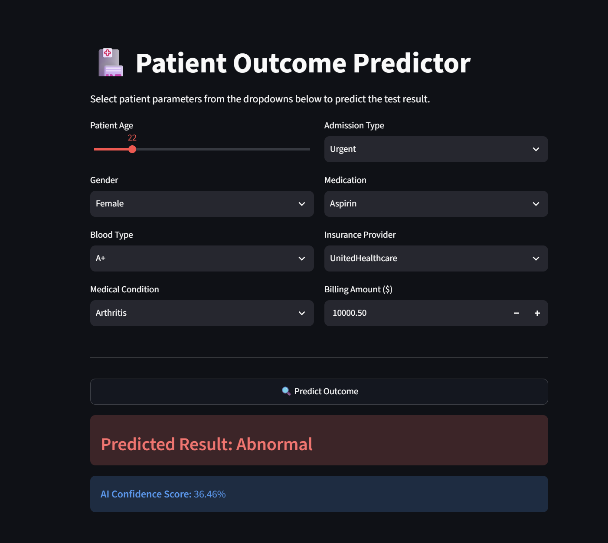

# End-to-End Healthcare ML Prediction Application

[](https://healthcare-ml-frontend.onrender.com)
[](https://healthcare-ml-backend-t4bm.onrender.com/docs)
[](https://www.docker.com/)
[](https://github.com/astral-sh/uv)

An end-to-end machine learning application that predicts patient healthcare outcome results based on admission metrics, demographics, and clinical attributes. Built with an isolated microservices architecture, fully containerized, unit-tested, and deployed to cloud infrastructure.

---

---

## 📸 Application Preview



---


## 🔗 Live Application Links

* **Interactive Web App**: [https://healthcare-ml-frontend.onrender.com](https://healthcare-ml-frontend.onrender.com)
* **REST API Documentation**: [https://healthcare-ml-backend-t4bm.onrender.com/docs](https://healthcare-ml-backend-t4bm.onrender.com/docs)

---

## System Architecture
```text
[ User UI (Streamlit) ]
│
│ HTTP POST (/predict)
▼
[ REST API (FastAPI) ]
│
├─► Data Validation (Pydantic)
├─► Feature Encoders (Joblib)
└─► ML Inference Engine (XGBoost)
```

Both services are decoupled, containerized using **Docker**, and communicated over an isolated network using **Docker Compose** locally and dedicated cloud web services on **Render**.

---

## Tech Stack

* **Backend Framework**: FastAPI, Uvicorn, Pydantic
* **Frontend UI**: Streamlit
* **Machine Learning**: Scikit-Learn, XGBoost, Joblib
* **Package Management**: `uv` (Ultra-fast Python package resolver)
* **Testing & Quality Assurance**: `pytest`, `httpx`
* **Containerization**: Docker, Docker Compose, WSL 2
* **Cloud Hosting**: Render

---

## Repository Structure

```text
.
├── app/                  # FastAPI Application Logic
│   └── main.py           # API Endpoints & Model Inference Engine
├── frontend/             # Streamlit Dashboard Interface
│   └── app.py            # User Input Forms & Network Requests
├── models/               # Saved Machine Learning Artifacts
│   ├── xgboost_model.joblib
│   ├── feature_cols.joblib
│   ├── encoders.joblib
│   └── target_encoder.joblib
├── tests/                # Automated Unit Tests
│   ├── conftest.py       # Test Suite Environment Config
│   └── test_api.py       # API Endpoint Unit Tests
├── Dockerfile.backend    # Docker image spec for FastAPI
├── Dockerfile.frontend   # Docker image spec for Streamlit
├── docker-compose.yml    # Multi-container local orchestration
├── pyproject.toml        # Project dependencies & tool configurations
└── README.md

```

## Local Quickstart Guide
Prerequisites
Docker Desktop installed and running.

uv package manager installed.

Run with Docker Compose
Bash
git clone [https://github.com/Tessy365/healthcare-ml-project.git](https://github.com/Tessy365/healthcare-ml-project.git)
cd healthcare-ml-project

docker compose up --build

Streamlit UI: http://localhost:8501

FastAPI Docs: http://localhost:8000/docs

## Running Unit Tests
Execute unit tests against API routes and validation schemas:

Bash
uv run pytest